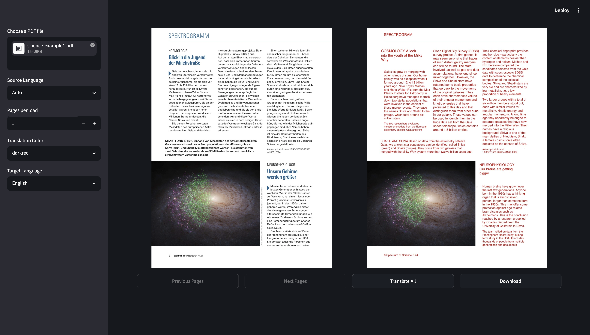
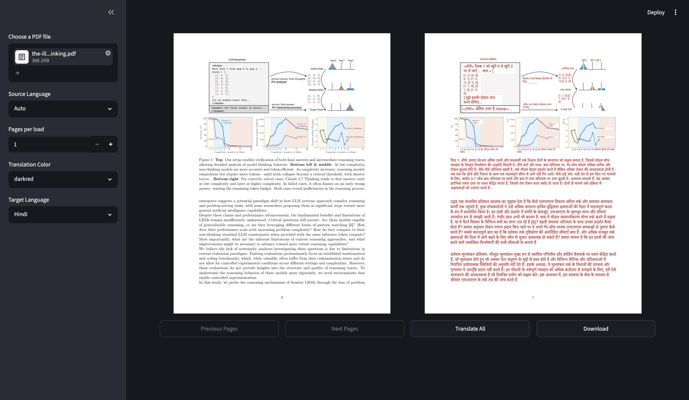

# Language Translation PDF

This project is a straightforward application designed to translate PDF documents from one language to another while attempting to preserve the original structure and layout of the file.

## Architecture Diagram

## Process
The application works by reading an input PDF and extracting its text blocks. It then processes these blocks through a translation engine and rewrites the translated text back into a new PDF document. To improve speed and efficiency, the system uses a local database cache to store previously translated sentences, preventing redundant API calls.

## Current Status
Active development is currently focused on fixing alignment and pattern issues. Since translated text often expands or contracts compared to the original language, work is being done to ensure the layout remains perfectly aligned without overlapping.

## Usage
The application is designed so that anyone can use it simply:
1. Install the required dependencies listed in the requirements.txt file.
2. Run the translator.py file to start the application.
3. You can use the sample files provided in the test pdfs folder to try out the translation process.
4. Once processed, your finished documents will be saved automatically in the output pdfs folder.

## Outputs

## Project Structure
Based on the repository layout, here are the main components of the project:

* translator.py: The main application script that runs the user interface and translation logic.
* translation_cache.py: The local caching system that stores translated text to speed up future runs.
* pdf_translator: The core module folder that handles the reading, layout analysis, and rewriting of the PDF files.
* architecture_diagram.drawio.svg: The visual architecture diagram showing how the system components interact.
* test pdfs: A directory containing sample PDF files you can use to test the software.
* output pdfs: The directory where all your translated PDF files are saved.
* requirements.txt: The file containing all the necessary Python packages to run the project.
